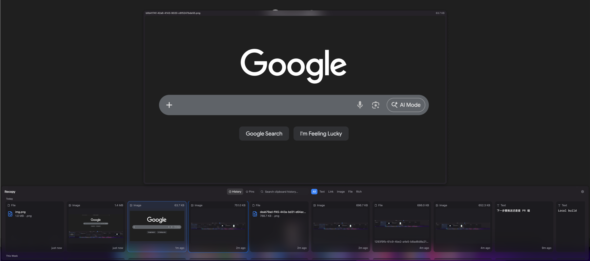

# Recopy

[](https://github.com/shiqkuangsan/Recopy/releases)
[](LICENSE)
[](https://github.com/shiqkuangsan/Recopy/releases)
[](https://github.com/shiqkuangsan/Recopy/releases)

A free, source-available clipboard history manager for macOS and Windows.

> Every copy you make, always within reach.

English | [中文](README.zh-CN.md)

### Dark Mode


<details>
<summary>More screenshots</summary>

### Light Mode


### Quick Look Preview


</details>

## Installation

### Homebrew (macOS)

```bash
brew install --cask shiqkuangsan/recopy/recopy

# update to latest version
brew upgrade --cask recopy
```

### Manual Download

Download the latest `.dmg` or `.exe` from the [Releases](https://github.com/shiqkuangsan/Recopy/releases) page.

> [!IMPORTANT]
> **macOS users:** Recopy is not code-signed yet. macOS will show **"app is damaged"** or **"cannot be opened"** on first launch. This is normal — just run this command in Terminal to fix it:
>
> ```bash
> xattr -d com.apple.quarantine /Applications/Recopy.app
> ```
>
> Or right-click the app → Open → click "Open" in the dialog. You only need to do this once.
>
> See the [full macOS installation guide](docs/macos-unsigned-app.md) for more details.

## Features

- **Full-type support** — Plain text, rich text, images, files, and links
- **Instant recall** — `Cmd+Shift+V` to summon, arrow keys to navigate, Enter to paste
- **Quick Look preview** — Press Space to preview any item with Finder-style zoom animation
- **Smart dedup** — SHA-256 hash prevents duplicate entries, bumps latest to top
- **Full-text search** — FTS5 with trigram tokenizer for Chinese/English fuzzy search
- **Link detection** — URLs auto-recognized with dedicated cards, `Cmd+Click` to open in browser
- **IME friendly** — Search works correctly with Chinese input methods (composition-aware)
- **Favorites** — Pin frequently used items for quick access
- **Non-activating panel** — NSPanel on macOS, never steals focus from your active app
- **Copy HUD** — Frosted glass feedback overlay when copying to clipboard
- **Auto-update** — Built-in update checker with in-app download and one-click restart
- **Configurable** — Theme (dark/light/system), language (en/zh), shortcut, auto-start, retention policy
- **Privacy first** — All data stored locally in SQLite, nothing leaves your machine

## Keyboard Shortcuts

| Key | Action |
|-----|--------|
| `Cmd+Shift+V` | Toggle Recopy panel (customizable in settings) |
| `←` `→` | Navigate between items |
| `↑` `↓` | Jump between date groups |
| `Enter` | Paste selected item |
| `Space` | Quick Look preview |
| `Cmd+C` | Copy to clipboard (with HUD feedback) |
| `Cmd+F` | Focus search |
| `Cmd+,` | Open settings |
| `Escape` | Close panel / blur search |

## Settings

Open settings via the gear icon in the panel header, tray menu, or `Cmd+,`.

- **General** — Theme (dark/light/system), language (en/zh/system), global shortcut, auto-start, close-on-blur
- **History** — Retention policy (unlimited/days/count), max item size (1–100 MB), clear history
- **Privacy** — Accessibility permission guide, app exclusion list (coming soon)
- **About** — Version, license, tech stack

## Tech Stack

| Layer | Technology |
|-------|-----------|
| Framework | [Tauri v2](https://v2.tauri.app) |
| Frontend | React 19 + TypeScript + Tailwind CSS v4 |
| Backend | Rust |
| Database | SQLite (SQLx, WAL mode) |
| State | Zustand |
| UI | Radix UI + Lucide Icons |
| i18n | react-i18next |
| Platform | NSPanel (macOS), virtual scrolling (@tanstack/react-virtual) |

## Getting Started

### Prerequisites

- [Node.js](https://nodejs.org/) 22+
- [pnpm](https://pnpm.io/) 10+
- [Rust](https://rustup.rs/) 1.77+
- Xcode Command Line Tools (macOS) or Visual Studio Build Tools (Windows)

### Development

```bash
# Install dependencies
pnpm install

# Start dev server (Vite + Rust hot-reload)
pnpm tauri dev

# Run tests
npx vitest run             # Frontend
cd src-tauri && cargo test # Backend

# Type check
npx tsc --noEmit

# Production build
pnpm tauri build
```

### Build Output

| Platform | Format |
|----------|--------|
| macOS | `.dmg` |
| Windows | NSIS installer |

## Architecture

```
Recopy
├── src/                  # React frontend
│   ├── components/       # UI components (cards, search, filters, settings)
│   ├── stores/           # Zustand state management
│   ├── hooks/            # Keyboard navigation, thumbnail lazy-loading
│   └── i18n/             # Locale files (zh, en)
├── src-tauri/
│   └── src/
│       ├── lib.rs        # App setup, tray (i18n), shortcuts, clipboard monitor
│       ├── commands/     # Tauri IPC commands (CRUD, paste, settings, shortcuts)
│       ├── db/           # SQLite models, queries, migrations
│       ├── clipboard/    # Hashing, thumbnails (async), image storage
│       └── platform/     # macOS NSPanel + HUD / Windows fallback
└── website/              # Landing page
```

### Paste Flow

1. User presses Enter on a clipboard item
2. Rust writes content to system clipboard
3. NSPanel resigns key window (returns focus to previous app)
4. `osascript` simulates Cmd+V with 50ms delay
5. Panel hides — user sees content pasted seamlessly

## Roadmap

- [x] ~~Auto-update~~ — shipped in v1.0.0 via tauri-plugin-updater
- [ ] Source app display (data model ready, card UI pending)
- [ ] App exclusion list (skip password managers, etc.)

## License

[PolyForm Noncommercial 1.0.0](LICENSE)
