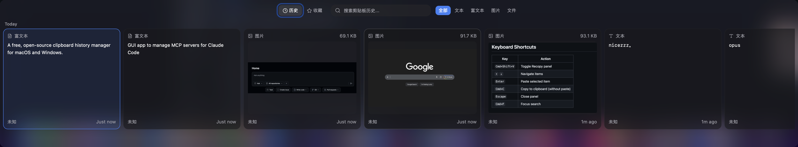

# Recopy

[](https://github.com/shiqkuangsan/Recopy/releases)
[](LICENSE)
[](https://github.com/shiqkuangsan/Recopy/releases)
[](https://github.com/shiqkuangsan/Recopy/releases)

免费、源码开放的剪贴板历史管理工具，支持 macOS 和 Windows。

> 你的每一次复制，都不会再丢失。

[English](README.md) | 中文



## 安装

从 [Releases](https://github.com/shiqkuangsan/Recopy/releases) 页面下载最新的 `.dmg` 安装包。

> [!IMPORTANT]
> **macOS 用户注意：** Recopy 尚未进行代码签名。首次打开时 macOS 会提示 **"应用已损坏"** 或 **"无法打开"**，这是正常现象——在终端执行以下命令即可解决：
>
> ```bash
> xattr -d com.apple.quarantine /Applications/Recopy.app
> ```
>
> 或者右键点击应用 → 打开 → 在弹窗中点击"打开"。只需操作一次，之后即可正常使用。
>
> 详细说明请参阅 [macOS 安装指南](docs/macos-unsigned-app.md)。

## 功能特性

- **全类型支持** — 纯文本、富文本、图片、文件、链接
- **一键召唤** — `Cmd+Shift+V` 呼出面板，方向键导航，Enter 粘贴
- **空格预览** — 按空格键预览任意条目，Finder 风格缩放动画
- **智能去重** — SHA-256 哈希自动去重，重复内容自动置顶
- **全文搜索** — FTS5 + trigram 分词，中英文模糊搜索
- **链接识别** — 自动识别 URL 并显示专属卡片，`Cmd+Click` 可在浏览器打开
- **输入法友好** — 搜索栏正确处理中文输入法组合输入
- **收藏夹** — 置顶常用条目，快速访问
- **不抢焦点** — macOS 使用 NSPanel，面板不会抢走前台应用的焦点
- **复制反馈** — 毛玻璃 HUD 提示，复制操作一目了然
- **自动更新** — 内置更新检查，应用内下载，一键重启升级
- **丰富设置** — 主题（深色/浅色/跟随系统）、语言（中/英）、快捷键、开机启动、保留策略
- **隐私优先** — 所有数据存储在本地 SQLite，不上传任何内容

## 快捷键

| 按键 | 功能 |
|------|------|
| `Cmd+Shift+V` | 显示/隐藏 Recopy 面板（可在设置中自定义） |
| `←` `→` | 左右导航条目 |
| `↑` `↓` | 在日期分组间跳转 |
| `Enter` | 粘贴选中条目 |
| `Space` | 快速预览选中条目 |
| `Cmd+C` | 复制到剪贴板（显示 HUD 反馈） |
| `Cmd+F` | 聚焦搜索框 |
| `Cmd+,` | 打开设置 |
| `Escape` | 关闭面板 / 退出搜索 |

## 设置

通过面板右上角齿轮图标、托盘菜单或 `Cmd+,` 打开设置。

- **通用** — 主题（深色/浅色/跟随系统）、语言（中/英/跟随系统）、全局快捷键、开机启动、失焦关闭
- **历史** — 保留策略（无限/按天数/按数量）、最大条目大小（1–100 MB）、清空历史
- **隐私** — 无障碍权限指引、应用排除列表（即将推出）
- **关于** — 版本、许可证、技术栈

## 技术栈

| 层级 | 技术 |
|------|------|
| 框架 | [Tauri v2](https://v2.tauri.app) |
| 前端 | React 19 + TypeScript + Tailwind CSS v4 |
| 后端 | Rust |
| 数据库 | SQLite（SQLx，WAL 模式） |
| 状态管理 | Zustand |
| UI 组件 | Radix UI + Lucide Icons |
| 国际化 | react-i18next |
| 平台适配 | NSPanel（macOS）、虚拟滚动（@tanstack/react-virtual） |

## 快速开始

### 环境要求

- [Node.js](https://nodejs.org/) 22+
- [pnpm](https://pnpm.io/) 10+
- [Rust](https://rustup.rs/) 1.77+
- Xcode Command Line Tools（macOS）或 Visual Studio Build Tools（Windows）

### 开发

```bash
# 安装依赖
pnpm install

# 启动开发服务器（Vite + Rust 热重载）
pnpm tauri dev

# 运行测试
npx vitest run             # 前端测试
cd src-tauri && cargo test # 后端测试

# 类型检查
npx tsc --noEmit

# 生产构建
pnpm tauri build
```

### 构建产物

| 平台 | 格式 |
|------|------|
| macOS | `.dmg` |
| Windows | NSIS 安装包 |

## 项目结构

```
Recopy
├── src/                  # React 前端
│   ├── components/       # UI 组件（卡片、搜索、筛选、设置）
│   ├── stores/           # Zustand 状态管理
│   ├── hooks/            # 键盘导航、缩略图懒加载
│   └── i18n/             # 语言文件（zh、en）
├── src-tauri/
│   └── src/
│       ├── lib.rs        # 应用初始化、托盘（国际化）、快捷键、剪贴板监听
│       ├── commands/     # Tauri IPC 命令（CRUD、粘贴、设置、快捷键）
│       ├── db/           # SQLite 模型、查询、迁移
│       ├── clipboard/    # 哈希、缩略图（异步生成）、图片存储
│       └── platform/     # macOS NSPanel + HUD / Windows 兜底
└── website/              # 官网落地页
```

### 粘贴流程

1. 用户按下 Enter 选择一条剪贴板记录
2. Rust 将内容写入系统剪贴板
3. NSPanel 放弃 key window（焦点回到前台应用）
4. `osascript` 模拟 Cmd+V，延迟 50ms
5. 面板隐藏 — 内容无缝粘贴到目标应用

## 路线图

- [x] ~~自动更新~~ — 已在 v1.0.0 通过 tauri-plugin-updater 实现
- [ ] 来源应用展示（数据层已就绪，卡片 UI 待开发）
- [ ] 应用排除列表（跳过密码管理器等）

## 许可证

[PolyForm Noncommercial 1.0.0](LICENSE)
