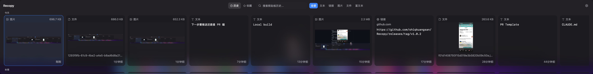
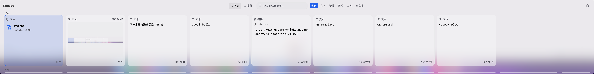
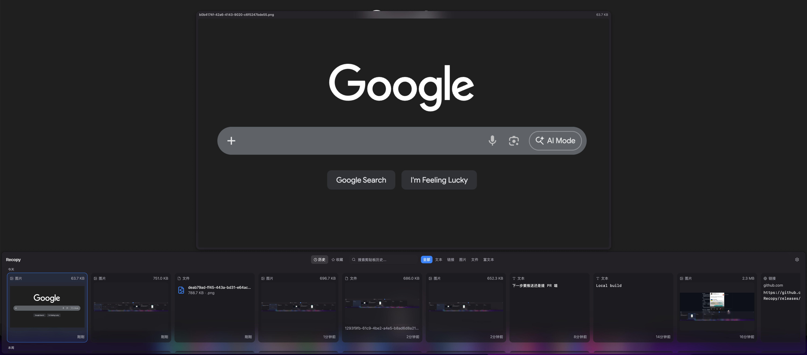

# Recopy

[](https://github.com/shiqkuangsan/Recopy/releases)
[](https://github.com/shiqkuangsan/Recopy/releases)
[](https://github.com/shiqkuangsan/Recopy/stargazers)
[](https://github.com/shiqkuangsan/Recopy/commits)
[](LICENSE)
[](https://v2.tauri.app)
[](https://github.com/shiqkuangsan/Recopy/releases)
[](https://github.com/shiqkuangsan/Recopy/releases)

免费、源码开放的剪贴板历史管理工具，支持 macOS 和 Windows。

> 你的每一次复制，都不会再丢失。

[English](README.md) | 中文

### 暗色模式


<details>
<summary>更多截图</summary>

### 亮色模式


### 快速预览


</details>

## 安装

### Homebrew（macOS）

```bash
brew install --cask shiqkuangsan/recopy/recopy

# 更新到最新版
brew upgrade --cask recopy
```

### 手动下载

从 [Releases](https://github.com/shiqkuangsan/Recopy/releases) 页面下载最新的 `.dmg` 或 `.exe` 安装包。

> [!IMPORTANT]
> **macOS 用户注意：** Recopy 尚未进行代码签名。首次打开时 macOS 会提示 **"应用已损坏"** 或 **"无法打开"**，这是正常现象——在终端执行以下命令即可解决：
>
> ```bash
> xattr -d com.apple.quarantine /Applications/Recopy.app
> ```
>
> 或者右键点击应用 → 打开 → 在弹窗中点击"打开"。只需操作一次，之后即可正常使用。
>
> 详细说明请参阅 [macOS 安装指南](docs/macos-unsigned-app.md)。

## 功能特性

- **全类型支持** — 纯文本、富文本、图片、文件、链接
- **一键召唤** — `Cmd/Ctrl+Shift+V` 呼出面板，方向键导航，Enter 粘贴，`Cmd/Ctrl+1–9` 快速粘贴
- **空格预览** — 按空格键预览任意条目，Finder 风格缩放动画
- **灵活布局** — 面板可停靠在屏幕任意边缘（下/上/左/右），顶部/底部布局支持分组或单行浏览
- **智能去重** — SHA-256 哈希自动去重，重复内容自动置顶
- **排序模糊搜索** — 支持文本、文件名、来源 App 的多关键词 AND 匹配，精确匹配和有序模糊匹配优先展示
- **链接识别** — 自动识别 URL 并显示专属卡片，`Cmd+Click` 可在浏览器打开
- **输入法友好** — 搜索栏正确处理中文输入法组合输入
- **收藏夹** — 可通过卡片星标、右键菜单或 `F` 收藏常用条目，收藏项不受清理影响
- **不抢焦点** — macOS 使用 NSPanel，Windows 通过前台窗口恢复与键盘钩子实现——面板不会抢走前台应用焦点
- **复制反馈** — 毛玻璃 HUD 提示，复制操作一目了然
- **自动更新** — 内置更新检查，应用内下载，一键重启升级
- **丰富设置** — 主题、语言、快捷键、托盘图标、面板位置、打开时选中策略、单行模式、开机启动、保留策略
- **隐私优先** — 剪贴板数据保存在本地 SQLite；只有更新检查/下载会访问发布端点

## 快捷键

| 按键 | 功能 |
|------|------|
| `Cmd/Ctrl+Shift+V` | 显示/隐藏 Recopy 面板（可在设置中自定义） |
| `←` `→` / `↑` `↓` | 根据面板布局导航条目和日期分组 |
| `Enter` | 粘贴选中条目 |
| `Space` | 快速预览选中条目 |
| `Cmd/Ctrl+1` ... `9` | 快速粘贴可见目标 |
| `Cmd/Ctrl+C` | 复制到剪贴板（显示 HUD 反馈） |
| `Cmd/Ctrl+F` | 聚焦搜索框 |
| `F` | 收藏 / 取消收藏选中条目 |
| `Tab` | 在历史与收藏视图间切换 |
| `Cmd/Ctrl+[` / `Cmd/Ctrl+]` | 切换上一个 / 下一个类型筛选 |
| `Cmd/Ctrl+↑` | 选中第一条 |
| `Cmd/Ctrl+←` | 选中当前分组第一条（顶部/底部布局） |
| `Cmd/Ctrl+,` | 打开设置 |
| `Delete` / `Backspace` | 删除选中条目 |
| `Escape` | 关闭面板 / 退出搜索 |

## 设置

通过面板右上角齿轮图标、托盘菜单或 `Cmd/Ctrl+,` 打开设置。

- **通用** — 主题（深色/浅色/跟随系统）、语言（中/英/跟随系统）、全局快捷键、面板位置（下/上/左/右）、打开面板时选中策略、单行模式、托盘图标、开机启动、失焦关闭
- **历史** — 保留策略（无限/按天数/按数量）、最大条目大小（1–100 MB）、存储占用、清空非收藏历史
- **隐私** — 无障碍权限指引、应用排除列表（即将推出）
- **关于** — 版本、更新检查频率、相关链接、许可证、Homebrew 状态、退出应用

## 技术栈

| 层级 | 技术 |
|------|------|
| 框架 | [Tauri v2](https://v2.tauri.app) |
| 前端 | React 19 + TypeScript + Tailwind CSS v4 |
| 后端 | Rust |
| 数据库 | SQLite（SQLx，WAL 模式） |
| 状态管理 | Zustand |
| UI 组件 | Radix UI + Lucide Icons |
| 国际化 | react-i18next |
| 平台适配 | NSPanel（macOS）、键盘钩子（Windows）、虚拟滚动（@tanstack/react-virtual） |

## 快速开始

### 环境要求

- [Node.js](https://nodejs.org/) 22+
- [pnpm](https://pnpm.io/) 10+
- [Rust](https://rustup.rs/) 1.77+
- Xcode Command Line Tools（macOS）或 Visual Studio Build Tools（Windows）

### 开发

```bash
# 安装依赖
pnpm install

# 启动开发服务器（Vite + Rust 热重载）
pnpm tauri dev

# 运行测试
npx vitest run             # 前端测试
cd src-tauri && cargo test # 后端测试

# 类型检查
npx tsc --noEmit

# 生产构建
pnpm tauri build
```

### 构建产物

| 平台 | 格式 |
|------|------|
| macOS | `.dmg` |
| Windows | NSIS 安装包 |

## 项目结构

```
Recopy
├── src/                  # React 前端
│   ├── components/       # UI 组件（卡片、搜索、筛选、设置）
│   ├── stores/           # Zustand 状态管理
│   ├── hooks/            # 键盘导航、缩略图懒加载
│   └── i18n/             # 语言文件（zh、en）
├── src-tauri/
│   └── src/
│       ├── lib.rs        # 应用初始化、托盘（国际化）、快捷键、剪贴板监听
│       ├── commands/     # Tauri IPC 命令（CRUD、粘贴、设置、快捷键）
│       ├── db/           # SQLite 模型、查询、迁移
│       ├── clipboard/    # 哈希、缩略图（异步生成）、图片存储
│       └── platform/     # macOS NSPanel + HUD / Windows 非激活窗口 + 键盘钩子
└── website/              # 官网落地页
```

### 粘贴流程

**macOS：**
1. 用户按下 Enter 选择一条剪贴板记录
2. Rust 将内容写入系统剪贴板
3. NSPanel 放弃 key window（焦点回到前台应用）
4. `osascript` 模拟 Cmd+V，延迟 50ms
5. 面板隐藏 — 内容无缝粘贴到目标应用

**Windows：**
1. 用户按下 Enter 选择一条剪贴板记录
2. Rust 将内容写入系统剪贴板
3. 窗口隐藏，恢复前台应用焦点
4. `SendInput` 模拟 Ctrl+V，延迟 50ms
5. 内容粘贴到仍保持焦点的目标应用

## 许可证

[PolyForm Noncommercial 1.0.0](LICENSE)
